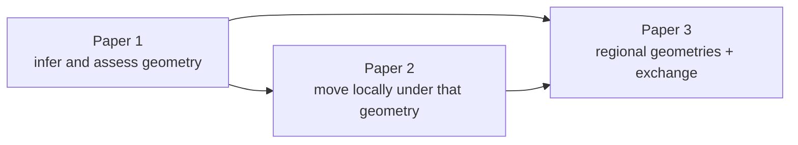

# Project Geodesic

**The global↔local sampling research program.**

Sampling algorithms observe local information—gradients, trajectories, and
draws from the regions they have reached—while efficient inference depends on
global posterior geometry. Project Geodesic studies how a sampling routine can
infer that geometry, exploit it, and refuse a misleading global summary when
the available evidence does not support one.

The name is deliberate: a geodesic is a globally meaningful path determined by
local geometry.

## The three-paper program

| Part | Paper | Role | Status |
|---|---|---|---|
| 1 | [The Universal Warmup Path: Many Routes, One Compass](papers/01-universal-warmup-path/) | Learn and assess a geometric reference during warmup | Circulation draft |
| 2 | [The Universal Sampler](papers/02-universal-sampler/) | Make efficient local moves conditional on the learned geometry | Proposal; kernel implemented, validation pending |
| 3 | [The Nested Ensemble](papers/03-nested-ensemble/) | Replace one constant metric with regional metric fields and population exchange | Proposal |

The common compass is the posterior covariance $\Sigma_\pi$. It is a global
reference, not a promise that one constant covariance-derived metric is an
adequate representation everywhere. Finite warmup evidence may support a
route-conditioned metric, ask for more evidence, recommend
reparameterization, or hand off to a population method.

The complete research proposal is in [PROGRAM.md](PROGRAM.md).

## Paper 1

The Paper 1 directory contains the circulation-ready manuscript, figures,
frozen summaries, checksummed result transcripts, and reproduction scripts.
The 471 MB immutable array
[sidecar](papers/01-universal-warmup-path/experiments/paper1-full-29d246-20260726-v1-npz.tar.zst)
is stored with Git LFS rather than as a normal Git blob. Its exact filename,
size, member inventory, extraction policy, and SHA-256 digest are recorded in
the Paper 1 experiment metadata.

The implementation is merged in BlackJAX at
[`2103a4275`](https://github.com/blackjax-devs/blackjax/commit/2103a4275b4d29b1650ba06458d5703eb7302b2e)
through [blackjax-devs/blackjax#1011](https://github.com/blackjax-devs/blackjax/pull/1011).
The frozen experiments retain the exact executed revision
[`29d246885`](https://github.com/blackjax-devs/blackjax/commit/29d2468857be4de1644ca4470c2a4aa7f8137656);
its `blackjax/adaptation/meta` tree is identical at the merged revision.

## Repository boundaries

- This repository owns the papers, proposals, experiment code, frozen
  empirical records, and citation metadata.
- BlackJAX owns the reference implementation. This repository pins immutable
  revisions and reconstruction artifacts rather than maintaining a library
  fork.
- Individual paper directories state their own claim scope and reproduction
  requirements.

## License and citation

The repository is licensed under Apache-2.0. See [CITATION.cff](CITATION.cff)
for repository-level citation metadata; cite individual papers when referring
to their scientific results.
